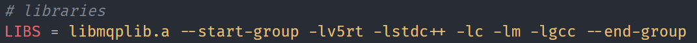
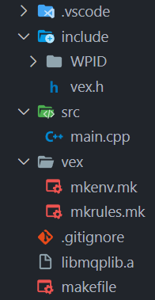

## How to create a VEX library:

1. Go to makefile and change `all: $(BUILD)/$(PROJECT).bin` to `all: $(BUILD)/$(PROJECTLIB).lib`
2. Build your project normally with the extension button

## How to apply any library:

1. Copy over all `.h` files associated with the library into the `include` folder
2. Copy over the `.a` archive file that you created in the `build` folder of the library's project (provided if someone else made it)
3. In `vex/mkenv` add the `.a` file's name to the `LIB` variable
---
If you include our library it should look like this:

`vex/mkenv` line `05`:

The .a file and header files (WPID folder) in the project:

